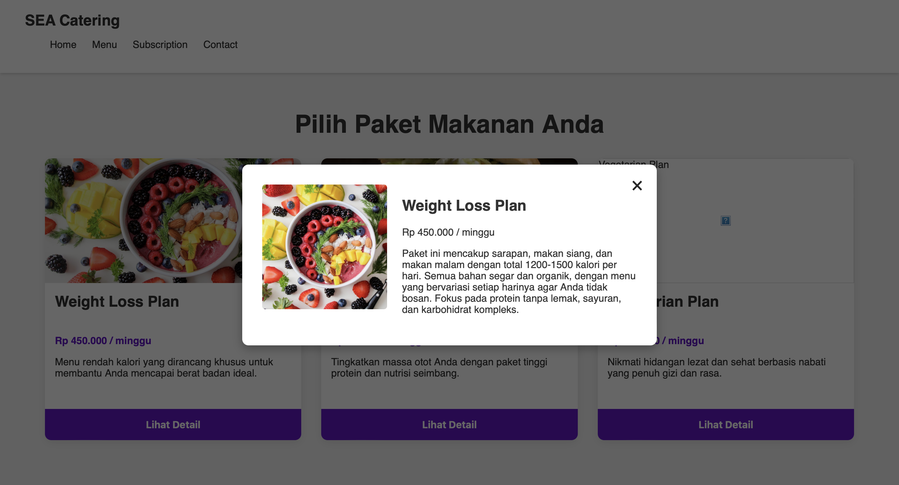

# Submission Proyek Seleksi: SEA Catering - Level 1

Selamat datang di submission saya untuk Level 1 dari Pre-Test Software Engineering Academy CompFest 17. Proyek ini adalah sebuah halaman depan (Homepage) statis untuk brand fiktif "SEA Catering".

### 🔴 Live Demo

Proyek ini dapat diakses dan dilihat secara langsung melalui link berikut:

**https://kidstarkprojects.github.io/sea-catering-submission/**

---

### 📸 Tampilan Proyek



---

### 🚀 Proses Pengembangan & Pembelajaran

Sebagai seseorang yang memulai dari nol, proyek ini adalah perjalanan belajar pertama saya dalam dunia pengembangan web. Berikut adalah proses yang saya lalui:

1.  **Struktur (HTML):** Saya belajar untuk menyusun kerangka halaman menggunakan tag-tag semantik seperti `<header>`, `<main>`, `<section>`, dan `<footer>`. Tantangan terbesar adalah memahami bagaimana setiap elemen saling bersarang (nesting) dengan benar, namun setelah diperbaiki, strukturnya menjadi jauh lebih logis.
2.  **Styling (CSS):** Ini adalah bagian paling menarik. Saya belajar konsep fundamental seperti:
    * **Box Model:** Mengatur `padding` untuk memberi ruang bernapas.
    * **Flexbox & Grid:** Saya menggunakan `display: grid` untuk menyusun kartu fitur secara berdampingan, yang merupakan konsep baru bagi saya.
    * **Styling Latar Belakang:** Memberi gambar latar belakang pada *hero section* dan membuatnya terlihat bagus dengan `background-size: cover`.
3.  **Problem Solving:** Saya sempat mengalami kesulitan menempatkan judul "Layanan Utama Kami" di tengah. Melalui ini, saya belajar bahwa saya perlu memilih elemen pembungkusnya (`.features-section`) dan menerapkan `text-align: center;` padanya.

Proyek ini mengajarkan saya bahwa pengembangan web bukan hanya tentang menulis kode, tetapi tentang memecahkan masalah visual dan struktural secara logis.

---

### 🛠️ Teknologi yang Digunakan

* HTML5
* CSS3 (Vanilla - Tanpa Framework)
* Git & GitHub untuk Version Control

---

### 💻 Cara Menjalankan Proyek Secara Lokal

Proyek ini adalah website statis murni dan tidak memerlukan proses instalasi atau konfigurasi apa pun.

1.  **Clone repository ini:**
    ```bash
    git clone [https://github.com/KidStarkProjects/sea-catering-submission]
    ```
2.  **Masuk ke direktori proyek:**
    ```bash
    cd [sea-catering-submission]
    ```
3.  Buka file `index.html` langsung di browser pilihan Anda (Google Chrome, Firefox, dll.). Selesai!

---

### ✨ **Level 2: Interaktivitas dengan JavaScript**

Pada level ini, website statis dikembangkan menjadi aplikasi yang interaktif dan responsif menggunakan JavaScript.

**Fitur yang Diimplementasikan:**

1.  **Navigasi Responsif:**
    * Membuat struktur multi-halaman (`index.html`, `menu.html`, dll.).
    * Mengimplementasikan "Hamburger Menu" untuk tampilan mobile yang berfungsi penuh, mengubah ikon menjadi 'X' saat aktif.
    * Menambahkan *highlight* pada link navigasi untuk menandakan halaman yang sedang aktif.

2.  **Tampilan Paket Makanan Interaktif:**
    * Membuat halaman menu dengan kartu-kartu paket makanan yang dinamis.
    * Mengimplementasikan **Modal Pop-up** yang muncul saat tombol "Lihat Detail" di-klik.
    * JavaScript digunakan untuk mengambil data dari atribut `data-*` pada tombol dan mengisinya secara dinamis ke dalam modal.

3.  **Bagian Testimoni:**
    * Menambahkan formulir untuk pengguna mengirimkan ulasan.
    * Membuat **Slider Testimoni** sederhana dengan tombol "Next" dan "Previous" yang berfungsi untuk menavigasi ulasan.

**Tantangan & Pembelajaran:**
* **Manipulasi DOM:** Belajar menggunakan `document.querySelector` dan `addEventListener` untuk membuat halaman merespons aksi pengguna.
* **Scope & Error Handling:** Menghadapi dan memperbaiki `ReferenceError` dengan memahami bahwa script perlu "menjaga" dirinya sendiri, hanya menjalankan kode jika elemen yang relevan ada di halaman tersebut. Ini adalah pelajaran penting dalam membuat kode yang modular dan bebas dari bug.

---

### 🔥 **Level 3 (Stretch Goal): Kalkulator Harga Interaktif**

Sebagai tantangan tambahan, bagian pertama dari Level 3 berhasil diimplementasikan.

* **Fitur yang Diimplementasikan:**
    * Membuat halaman formulir berlangganan yang terstruktur dengan berbagai tipe input (`radio`, `checkbox`).
    * Mengimplementasikan **kalkulator harga *real-time*** menggunakan JavaScript. Total harga akan otomatis ter-update setiap kali pengguna mengubah pilihan paket, tipe makanan, atau hari pengiriman.
* **Pembelajaran:**
    * Berhasil mengatasi masalah **kompatibilitas browser** (Safari vs. Chrome) dengan menulis kode JavaScript yang lebih 'aman' dan 'robust'.
    * Mendalami proses **debugging** menggunakan Developer Console untuk melacak error seperti `ReferenceError`.